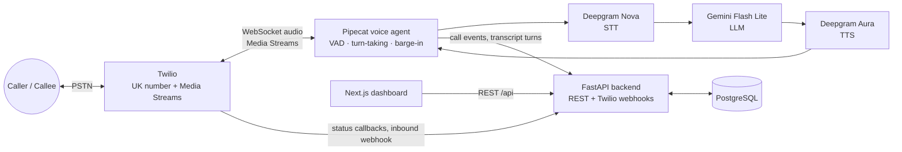

# Architecture

## System Diagram

## Data Flow

**Inbound:** caller dials Twilio number → Twilio hits `POST /twilio/inbound` (via ngrok) → backend replies with TwiML `<Connect><Stream>` pointing at the agent's WebSocket → Pipecat pipeline runs (audio in → Deepgram STT → Gemini → Deepgram TTS → audio out) → transcript turns and call status persisted to Postgres → dashboard reads via REST.

**Outbound:** dashboard triggers campaign → backend calls Twilio REST API to originate call with the same `<Connect><Stream>` TwiML → identical pipeline from there. One shared pipeline; only call setup differs.

## Technology Choices & Rationale

Decisions below are **locked**. Do not swap vendors or frameworks unless the owner explicitly reopens the decision here.

| Choice | Why | Alternatives considered |
|---|---|---|
| **Twilio** | Best docs, easy number provisioning, mature Media Streams WebSocket API, trial credit. Fastest to a working demo. | Telnyx (cheaper, weaker docs); self-hosted SIP/Asterisk (no per-min cost but weeks of ops work); Vonage (fewer AI-voice examples). |
| **Pipecat** | Open-source Python framework purpose-built for voice agents: VAD, interruptions, turn-taking handled. Any STT/LLM/TTS pluggable. Self-hosted → no per-minute platform fee and a clean production path. | LiveKit Agents (great at scale, heavier infra); Vapi/Retell (demo in hours but $0.05–0.15/min platform fee + lock-in); OpenAI Realtime (lowest latency, ~$0.30+/min, vendor-locked voices). |
| **Deepgram STT (Nova)** | Streaming-native, fast, $200 free credit covers the whole demo. | Whisper (not streaming-native); Google Chirp; AssemblyAI. |
| **Deepgram TTS (Aura)** | Same vendor/key as STT, low latency, free credit. Voice quality is adequate for demo. | Cartesia Sonic and ElevenLabs sound better — **planned upgrade path**; swap is a one-line Pipecat service change. |
| **Gemini Flash Lite** | Free-tier API key, fast + cheap, good enough conversational quality. | Claude Haiku (better quality, paid); GPT-4.1-mini (paid). |
| **One shared pipeline** | Same agent runtime for inbound/outbound; only call setup differs. Less code, consistent behavior. Prompt/config varies per campaign. | Separate pipelines — only justified if behaviors diverge heavily. |
| **FastAPI + Postgres** | Python matches Pipecat (one language, one repo). Postgres production-grade from day one — no SQLite migration later. | Node backend (second runtime); SQLite (migration friction); Supabase (vendor coupling, still need FastAPI for webhooks). |
| **Next.js + shadcn/ui** | Polished dashboard fast, huge ecosystem. | Vite SPA (fine, less convention); SvelteKit; FastAPI+HTMX (weak demo polish). |
| **Local + ngrok** | Zero hosting cost, fastest iteration; Twilio just needs a public HTTPS/WSS URL. | VPS (~$6/mo, always-on); Railway/Render free tier (WebSocket + cold-start risk for live audio). |
| **No auth** | Local-only demo. | Basic JWT login is the first thing to add if the dashboard gets a public URL. |
| **English only** | Deepgram and Gemini are multilingual; adding a language later is configuration (STT language, TTS voice, prompt), not rearchitecture. | — |

## Known Limitations (accepted for demo)

- Twilio **trial** restrictions: outbound only to verified numbers, trial announcement plays. ~$20 upgrade removes both.
- UK number requires regulatory bundle approval (days). US number as fallback.
- Single machine, no redundancy; a laptop sleep kills live calls.
- No auth on dashboard or API.
- Gemini free-tier rate limits (fine at demo call volume, not at scale).
- Sequential outbound dialer — one call at a time.
- No call recording audio storage (transcripts only).

## Scaling Past the Demo

1. **TTS upgrade:** Deepgram Aura → Cartesia or ElevenLabs (config swap in the Pipecat pipeline).
2. **Hosting:** Docker Compose on a VPS first; then split agent workers from API, run agents on machines near Twilio edge, autoscale on concurrent calls (LiveKit or k8s if call volume demands).
3. **Database:** managed Postgres (RDS/Supabase/Neon); add read replicas only if reporting load requires.
4. **Auth:** JWT login → multi-tenant orgs with roles.
5. **LLM:** paid Gemini tier or Claude Haiku for quality; per-campaign model choice.
6. **Compliance:** call recording consent, DNC list checks, recording storage (S3) — required before real outbound campaigns in production.
7. **Concurrency:** parallel outbound dialing with answer-machine detection (Twilio AMD).
