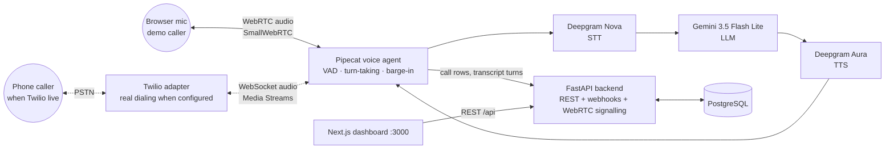

# Architecture

## System Diagram

```mermaid
flowchart LR
    Browser((Browser mic\ndemo caller))
    Caller((Phone caller\nwhen Twilio live))
    Twilio[Twilio adapter\nreal dialing when configured]
    Agent[Pipecat voice agent\nVAD · turn-taking · barge-in]
    DG_STT[Deepgram Nova\nSTT]
    Gemini[Gemini 3.5 Flash Lite\nLLM]
    DG_TTS[Deepgram Aura\nTTS]
    API[FastAPI backend\nREST + webhooks + WebRTC signalling]
    DB[(PostgreSQL)]
    FE[Next.js dashboard :3000]

    Browser <-->|WebRTC audio\nSmallWebRTC| Agent
    Caller <-.->|PSTN| Twilio
    Twilio <-.->|WebSocket audio\nMedia Streams| Agent
    Agent --> DG_STT --> Gemini --> DG_TTS --> Agent
    Agent -->|call rows, transcript turns| API
    API <--> DB
    FE -->|REST /api| API
```

Two transports feed **one shared pipeline** (`agent/pipeline.py`):

- **Browser web-call (live now):** dashboard call widget POSTs an SDP offer to `/api/webrtc/offer`; Pipecat's SmallWebRTC transport carries mic/speaker audio. This powers the whole demo without Twilio.
- **Twilio (implemented, not yet live-verified):** `/twilio/inbound` returns TwiML `<Connect><Stream>` into the `/twilio/media` WebSocket; outbound via Twilio REST origination, driven by a background campaign supervisor. Selected by configuration — see [TWILIO_INTEGRATION.md](TWILIO_INTEGRATION.md).

**Mode is a configuration decision, not a code path choice.** `telephony.dialing_mode()` returns `twilio` only when credentials, a number, and an `https://` public URL are all present; otherwise the system runs simulated browser dialing. That keeps the demo working everywhere and makes enabling real calls a `.env` change.

End-to-end mechanics of a call, and how to run the system: [PROCEDURE.md](PROCEDURE.md).

## Data Flow

**Inbound (demo):** user clicks "Call agent" → WebRTC session → pipeline (audio → Deepgram STT → Gemini → Deepgram TTS → audio) → call row + transcript turns persisted → dashboard reads via REST.

**Outbound campaigns (demo):** Start campaign → sequential dialer surfaces next pending contact → user answers as the contact in a web-call carrying the campaign script → after each call Gemini tags a disposition + summary and the queue advances; campaign completes when the queue empties.

**With Twilio:** same pipeline; only call setup changes (PSTN webhook / REST origination instead of browser offer).

## Technology Choices & Rationale

Decisions below are **locked**. Do not swap vendors or frameworks unless the owner explicitly reopens the decision here.

| Choice | Why | Alternatives considered |
|---|---|---|
| **Twilio** | Best docs, easy number provisioning, mature Media Streams WebSocket API, trial credit. Fastest to a working demo. | Telnyx (cheaper, weaker docs); self-hosted SIP/Asterisk (no per-min cost but weeks of ops work); Vonage (fewer AI-voice examples). |
| **Pipecat** | Open-source Python framework purpose-built for voice agents: VAD, interruptions, turn-taking handled. Any STT/LLM/TTS pluggable. Self-hosted → no per-minute platform fee and a clean production path. | LiveKit Agents (great at scale, heavier infra); Vapi/Retell (demo in hours but $0.05–0.15/min platform fee + lock-in); OpenAI Realtime (lowest latency, ~$0.30+/min, vendor-locked voices). |
| **Deepgram STT (Nova)** | Streaming-native, fast, $200 free credit covers the whole demo. | Whisper (not streaming-native); Google Chirp; AssemblyAI. |
| **Deepgram TTS (Aura)** | Same vendor/key as STT, low latency, free credit. Voice quality is adequate for demo. | Cartesia Sonic and ElevenLabs sound better — **planned upgrade path**; swap is a one-line Pipecat service change. |
| **Gemini Flash Lite** | Free-tier API key, fast + cheap, good enough conversational quality. Currently pinned to `gemini-3.5-flash-lite` (see note below). | Claude Haiku (better quality, paid); GPT-4.1-mini (paid). |
| **One shared pipeline** | Same agent runtime for inbound/outbound; only call setup differs. Less code, consistent behavior. Prompt/config varies per campaign. | Separate pipelines — only justified if behaviors diverge heavily. |
| **FastAPI + Postgres** | Python matches Pipecat (one language, one repo). Postgres production-grade from day one — no SQLite migration later. | Node backend (second runtime); SQLite (migration friction); Supabase (vendor coupling, still need FastAPI for webhooks). |
| **Next.js + shadcn/ui** | Polished dashboard fast, huge ecosystem. | Vite SPA (fine, less convention); SvelteKit; FastAPI+HTMX (weak demo polish). |
| **Local + ngrok** | Zero hosting cost, fastest iteration; Twilio just needs a public HTTPS/WSS URL. | VPS (~$6/mo, always-on); Railway/Render free tier (WebSocket + cold-start risk for live audio). |
| **No auth** | Local-only demo. | Basic JWT login is the first thing to add if the dashboard gets a public URL. |
| **English only** | Deepgram and Gemini are multilingual; adding a language later is configuration (STT language, TTS voice, prompt), not rearchitecture. | — |

### Gemini model pinning

The Gemini **model version** is not a locked vendor decision — Google retires
Flash Lite versions for new accounts without warning, surfacing as
`404 ... no longer available to new users`. When that happens, bump the version;
the vendor stays Gemini. The model name is pinned in **two** places and both
must move together:

- `agent/pipeline.py` → `GEMINI_MODEL` (conversation)
- `backend/app/services/disposition.py` → `model=` (post-call classification)

## Known Limitations (accepted for demo)

- **Twilio is not live-verified.** Credentials, phone number, and account are verified against the API and the adapter is unit-tested, but no real PSTN call has been placed; expect ~1 hour of verification.
- Campaign dialing is **simulated** unless Twilio is fully configured: user answers each call in the browser as the contact.
- **Single worker.** The dial supervisor runs one task per process; `uvicorn --workers N` would duplicate it. Multi-worker would need a `pg_try_advisory_lock` around the loop.
- Real dialing is **fail-closed** behind `OUTBOUND_ALLOWLIST` plus a daily cap — deliberate friction, since the alternative default is a live public URL with valid credentials and an unreviewed contact list.
- No answer-machine detection, so voicemail is recorded as `completed`.
- Twilio **trial** restrictions: outbound only to verified numbers, trial announcement plays. ~$20 upgrade removes both.
- UK number requires regulatory bundle approval (days). US number as fallback.
- Single machine, no redundancy; a laptop sleep kills live calls.
- No auth on dashboard or API.
- Gemini free-tier rate limits (fine at demo call volume, not at scale).
- Sequential outbound dialer — one call at a time.
- No call recording audio storage (transcripts only).

## Scaling Past the Demo

1. **TTS upgrade:** Deepgram Aura → Cartesia or ElevenLabs (config swap in the Pipecat pipeline).
2. **Hosting:** Docker Compose on a VPS first; then split agent workers from API, run agents on machines near Twilio edge, autoscale on concurrent calls (LiveKit or k8s if call volume demands).
3. **Database:** managed Postgres (RDS/Supabase/Neon); add read replicas only if reporting load requires.
4. **Auth:** JWT login → multi-tenant orgs with roles.
5. **LLM:** paid Gemini tier or Claude Haiku for quality; per-campaign model choice.
6. **Compliance:** call recording consent, DNC list checks, recording storage (S3) — required before real outbound campaigns in production.
7. **Concurrency:** parallel outbound dialing with answer-machine detection (Twilio AMD).
